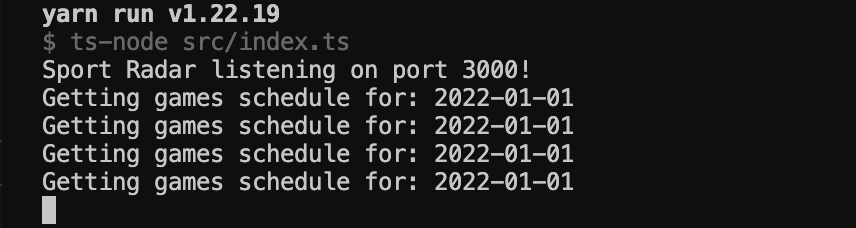
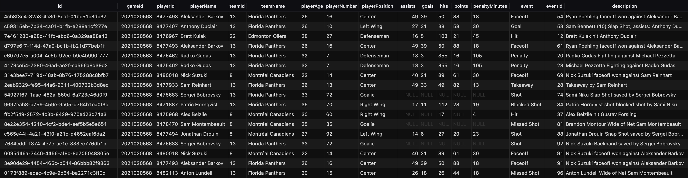

# sport-radar

This is a NodeJS application built to ingest data from the NHL API. This application uses Redis and BullMQ alongside PostgreSQL. This application was written for an assessment for Sport Radar.

Right now the application is configured to specifically check on Jan, 1st 2022 as at the time of doing this assessment there were no 'Live' games. The application will poll the schedule API, grab the games for that day, check if a game is 'Final', if so, will then attempt to process the plays and players for those plays and store them. If the status of any of the games changes it will no longer attempt to process the game. Also, if a play has already been stored it will no longer try to process it.

## Getting Started

---

1. Being that this is a NodeJS application its required that you have Node installed. I personally use NVM to manage my Node versions but you could install Node from thier website just the same.

- [Node]()

- [nvm](https://github.com/nvm-sh/nvm#installing-and-updating)

2. This application uses docker to setup Redis (for BullMQ) and establish a PostgreSQL database to store data. Intructions can be found [here](https://docs.docker.com/desktop/) for setting up the docker desktop client.

3. Since this application writes data to a PostgreSQL database its suggested to use a tool such as tablesPlus or dataGrip to execute querys. Database configuration can be found in the data-source.ts file. Test and establish your connection and once the application fires up you should be good to go.

Example queries:

> This gets all data from the play table which is used to track every play for a given game

```
SELECT * FROM "play"
```

> This gets all data from the play table where a specified ID is given

```
SELECT * FROM "play" WHERE "gameId" = '2021020573'
```

4. Once all the tools needed are installed and in place lets try and fire this bad boy up!
   > This should pull Redis and PostgreSQL docker images and establish connections to both

```
docker-compose up
```

```
npm start
```

> Or you can use yarn if you are super cool ;)

```
yarn start
```

From here you should see



If you switch over to your database tool of choice you should now be able to query as you please.



Again remember that I have configured this application to specifically look on Jan, 1st 2022 and only check if a game is in the status of 'Final'. I have provided functions to swap out to fufill the assessments specific requirements if so desired. In games-job.ts, uncomment `isGameLive` so that the application will specifically look for 'Live' status games. As well in scheduler.ts uncomment `getScheduleForTodaysDate` so that it will then poll the current date.

Lastly, I wanted to say thank you to anyone that has been involved in this process and I appreciate your time and for giving me this opportunity. I wish you all the best and have a wonderful morning/afternoon/evening. 

Thanks!